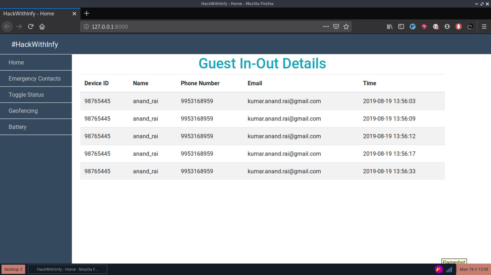
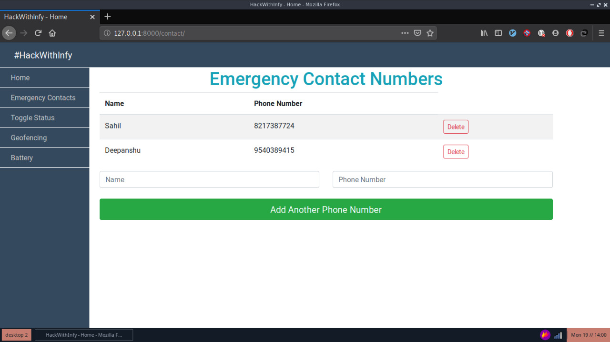
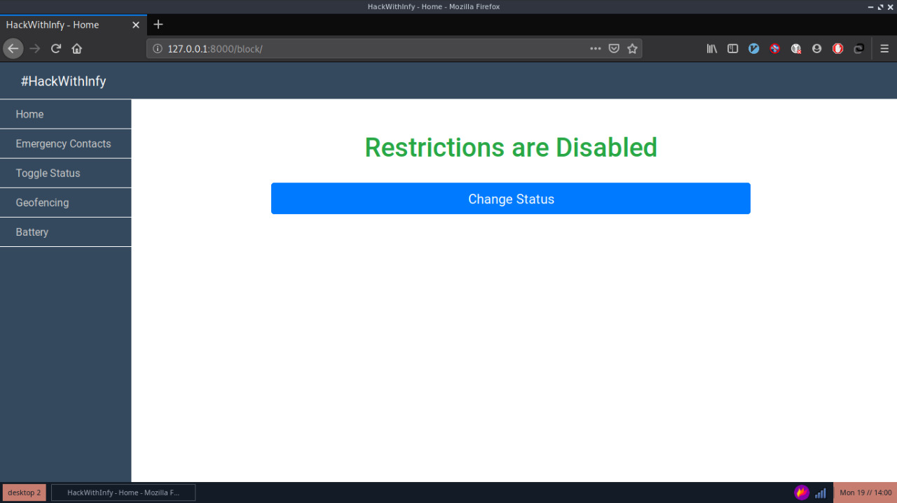

# Partially managed GeoFenced Mobile Phone
Developed this project in HackWithInfy grand finale. It has two modules : one Android app to scan QR Code, Geofencing, Emergency Calls to certain numbers, forcefully restrict some functionalities of android phone etc and other web app to remotely control and monitor the app.

My Contribution: Developed the web app with features like real time display the QR Code entry scanned by android app, add/edit emergency contacts, toggle some android app features, display the elementary data of phones like battery, Wifi, GPS etc

Tech Used : Flask, Google Firebase, JavaScript, Jquery and Bootstrap

